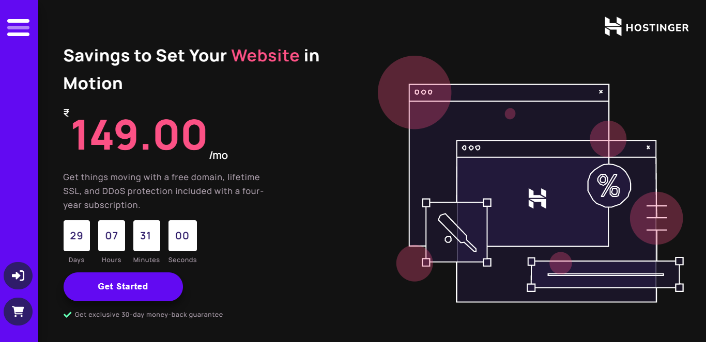

<br/>

# Hostinger - Redesigned Version Website

Here is the `Hostinger Redesigned website` for the [Thapa Technical Codefest 2](https://codefest.thapaonlineclass.com/).

<br/>


## 🖥️ Challenge Description : [Thapa Technical Codefest 2](https://codefest.thapaonlineclass.com/)

<br/>

Like our previous codefest, this codefest is also creating static website with no need of creating backend of the website. This time, it is compulsory for you to create a redesigned version of Hostinger website. You aren't supposed to create clone of it but to think yourself about how the design can be improved and implement it in code. You have to only code the front-end part, no back-end code is needed.

Here are the things that are important/required for your redesigned website:

Create redesigned landing page of Hostinger
- Responsive navbar and mega menu as an optional tweak
- Proper hero section
- Pricing section
- Testimonial section
- Services section
- Login/Register page (optionally)

You can also think about different other creative ideas to add into the website. Try not to imitate or clone the website but rather create redesigned version of it using your creativity. Making unrelated websites isn't allowed.

<br/>

# 🌍 Solution

<br/>

### Hostinger Original Version : [link](https://www.hostinger.in/)

<br/>

### Hostinger Redesigned Version : [link](https://sm8uti.github.io/Hostinger-Redesign-Website/)

<br/>

## 👩‍💻 Tech Stack

<br/>

**Technology:**
```Html, Css , Scss and Javascript```
<br/>


<br/>

## 📁 File Strutcture :

<br/>

```
|   .gitignore
|   banner.png
|   banner.svg
|   index.html
|   package-lock.json
|   package.json
|   README.md
|   screenshot.png
|
+---assets
|   +---brands
|   |       cloudflare.svg
|   |       lightspeed.svg
|   |       techstack.svg
|   |       wordpress.svg
|   |
|   +---icons
|   |       cart.svg
|   |       login.svg
|   |
|   +---logo
|   |       favicon.svg
|   |       logo.svg
|   |       name-logo.svg
|   |
|   \---vector
|           arrow.svg
|           correct.png
|           correct.svg
|           iMac.svg
|           line-2.svg
|           line.svg
|           message-cl.svg
|           message-op.svg
|           server-2.svg
|           server.svg
|           setting.svg
|           triangel.svg
|           web.svg
|
\---dist
    +---js
    |       main.js
    |
    \---scss
        |   main.css
        |   main.css.map
        |   main.scss
        |
        +---components
        |       _classes.scss
        |       _controlpanel.scss
        |       _details.scss
        |       _domain.scss
        |       _footer.scss
        |       _header.scss
        |       _hero.scss
        |       _index.scss
        |       _offers.scss
        |       _price.scss
        |       _services.scss
        |       _testomonials.scss
        |
        +---global
        |       _boilerplate.scss
        |       _colors.scss
        |       _fonts.scss
        |       _index.scss
        |
        \---util
                _breakpoints.scss
                _index.scss
```

<br/>

## 🌐 Color Section :

<br/>

```scss
:root{
    --neutral-100:#ffffff;
    --black-100:#121212;
    --gray-100:#B3A5B3;
    --blue-500:#620AF2;
    --blue-100:#6133df25;
    --blue-800:#2F1C6A;
    --pink-500:#FC5185;
    --pink-800:#DA2F63;
    --header-hv:rgba(98,51,223)
    --blue-gradient:linear-gradient(43.48deg, #4312A5 -3.88%, #6233DF 32.32%, #849BFF 137.32%);
}
```

- if you intrest change color code as you prefer then go the `dist > scss > global > colors.scss`

<br/>


## 🔠 Font Section : 

<br/>

- in this project i had used [Mulish](https://fonts.google.com/specimen/Mulish)
  - Font-weight : 400 500 600 700;

<br/>

```html
    <link rel="preconnect" href="https://fonts.googleapis.com">
    <link rel="preconnect" href="https://fonts.gstatic.com" crossorigin>
    <link href="https://fonts.googleapis.com/css2?family=Lexend+Deca:wght@400;600;700;800;900 family=Manrope:wght@400;500;600;700;800;900&display=swap" rel="stylesheet">
```

```css
:root{
    // font family 

    --ff-main:'Manrope',sans-serif;

    // font size 

    --sm-12:0.75rem;
    --sm-16:1rem;
    --sm-20:1.25rem;
    --sm-28:1.75rem;
    --md-32:2rem;
    --md-36:2rem;
    --md-40:2.5rem;
    --lg-56:3.5rem;
    --lg-80:5rem;

}
```

- if you intrest change font family as you prefer then go the `dist > scss > global > fonts.scss`

<br/>

# 💻 Screenshot




<br/>

# ©️ Copyright

<div class="copyright">
    <p>2022 <span>©</span> Copyright And Design By <a href="https://github.com/SM8UTI">SM8UTI 😃</a>And T Prabin Patra
    </p>
</div>

```
Boost Software License - Version 1.0 - August 17th, 2003

Permission is hereby granted, free of charge, to any person or organization
obtaining a copy of the software and accompanying documentation covered by
this license (the "Software") to use, reproduce, display, distribute,
execute, and transmit the Software, and to prepare derivative works of the
Software, and to permit third-parties to whom the Software is furnished to
do so, all subject to the following:

The copyright notices in the Software and this entire statement, including
the above license grant, this restriction and the following disclaimer,
must be included in all copies of the Software, in whole or in part, and
all derivative works of the Software, unless such copies or derivative
works are solely in the form of machine-executable object code generated by
a source language processor.

THE SOFTWARE IS PROVIDED "AS IS", WITHOUT WARRANTY OF ANY KIND, EXPRESS OR
IMPLIED, INCLUDING BUT NOT LIMITED TO THE WARRANTIES OF MERCHANTABILITY,
FITNESS FOR A PARTICULAR PURPOSE, TITLE AND NON-INFRINGEMENT. IN NO EVENT
SHALL THE COPYRIGHT HOLDERS OR ANYONE DISTRIBUTING THE SOFTWARE BE LIABLE
FOR ANY DAMAGES OR OTHER LIABILITY, WHETHER IN CONTRACT, TORT OR OTHERWISE,
ARISING FROM, OUT OF OR IN CONNECTION WITH THE SOFTWARE OR THE USE OR OTHER
DEALINGS IN THE SOFTWARE.
```

